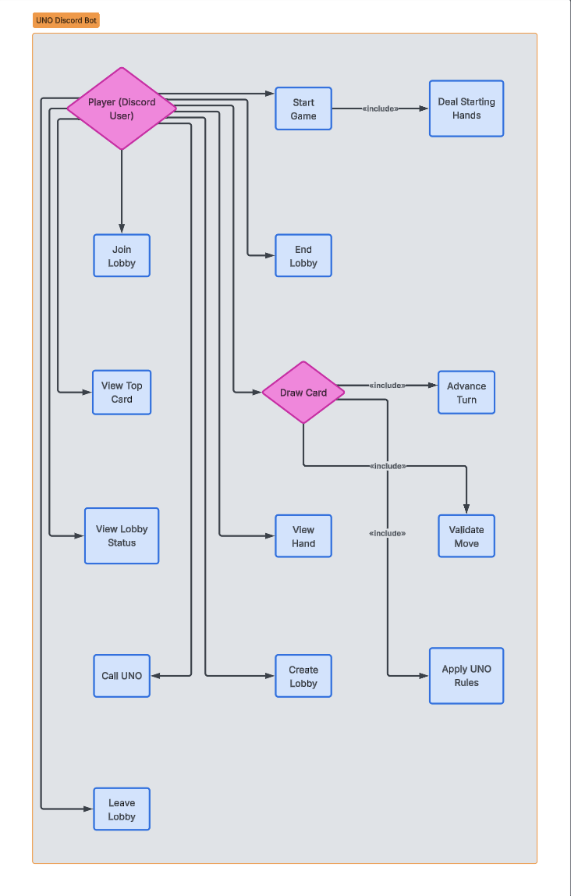

# Architecture of Our Bot

## Computer network diagram (Adam Khan)
This diagram shows how users interact with the UNO bot through Discord servers, where Discord acts as an intermediary that forwards events to the bot via the Discord API and returns the bot’s responses to users.

---

## System Context Diagram (Rio Dumecquias)
This diagram shows the Discord bot as the system, interacting with the external entities: Discord users, the Discord API, and a potentiall database. It notes all inputes to and outputs from the bot.

---

## Use Case Diagram (Khalid Abdullahi)
The diagram shows how players interact with the UNO Discord Bot through lobby commands, gameplay commands, and game logic based what we have now.
Figure X  

